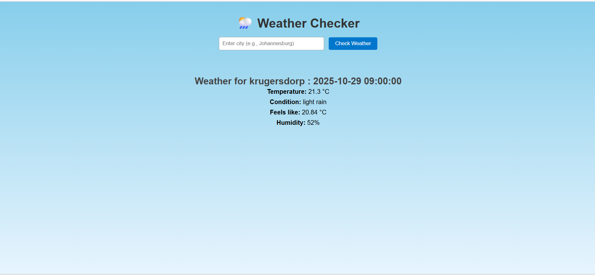

 ## WeatherApp — Real-Time Forecast Viewer

A Node.js + Express web app that fetches live weather data using the OpenWeather API. Built with EJS templating and Axios for API calls, this project demonstrates practical routing, middleware setup, and external API integration — ideal for showcasing full-stack fundamentals.

---

# Features

-  Search weather by city name
-  View current temperature, humidity, and conditions
-  Error handling for invalid or unreachable cities
-  Modular Express routing and middleware
-  Styled with custom CSS and EJS templates



---

# Tech Stack

| Layer         | Tools Used                     |
|--------------|---------------------------------|
| Backend       | Node.js, Express               |
| API Client    | Axios                          |
| Templating    | EJS                            |
| Styling       | CSS (served via Express static)|
| Environment   | dotenv (.env for API key)      |

---

# Project Structure

WeatherAPP/
├── index.js              # App entry point
├── routes/
│   └── routes.js         # Weather route logic
├── views/
│   └── index.ejs         # Main template
├── public/
│   └── css/style.css     # Styling
├── .env                  # API key (not committed)
├── package.json
└── README.md
   

# Project overview


---

## Setup Instructions

1. Clone the repo:
   ```bash
   git clone https://github.com/yourusername/weatherapp.git
   cd weatherapp
2- Install dependencies:
    npm install
3. 	Create a .env file:

    API_KEY=your_openweathermap_api_key
PORT=3000
4. 	Run the app:
    npm run dev

5. 	Visit:
     http://localhost:3000
